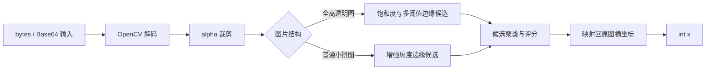

# 滑块缺口多特征融合识别设计

## 目标

`HumanBehaviorSimulator.slide_match_identify(target_data, background_data)` 接收小拼图与背景图，返回背景图原始坐标系中的缺口左侧整数 `x` 坐标。

设计需要覆盖压缩包中的多种透明图、尺寸和纹理结构，并允许后续使用开发样本适配新型缺口。

## 非目标

- 不下载图片或访问任何在线平台。
- 不控制浏览器，不生成滑动轨迹。
- 不换算 CSS 坐标、设备像素比或滑块手柄偏移。
- 不根据平台名称、文件名或单张样本坐标选择结果。

## 输入与输出

- `target_data`：小拼图，支持图片 `bytes`、纯 Base64 或 Base64 Data URL。
- `background_data`：背景图，支持相同输入类型。
- 成功返回：`int`，表示原始背景图中的横坐标。
- 解码失败、有效区域越界或没有可用候选时：抛出包含原因的 `ValueError`。

## 样本与数据隔离

`dev/样本.zip` 必须先解压。压缩包顶层目录已是 `样本/`，解压后路径为 `dev/样本/`，完整步骤见 [项目说明](../../项目说明.md)。

| 分区 | 数量 | 允许用途 |
|---|---:|---|
| `样本1` 至 `样本9` | 140 组 | 特征分析、实现和参数校准 |
| `验证样本` | 35 组 | 参数冻结后的回归验证 |

验证数据不能用于反复调参。新增类型时，应先加入开发集，并另外保留未参与实现的新样本作为验证集。

## 识别策略

### 1. 解码与有效区域

OpenCV 负责解码输入。透明 PNG 通过 alpha 通道裁掉无效区域，并保留裁剪框偏移，使最终结果可以映射回原图坐标。

### 2. 结构分流

- 全高透明图：alpha 通道通常已经给出有效纵向范围，重点搜索横坐标。
- 普通小拼图：在二维背景中进行增强灰度和边缘模板匹配。
- 不同宽高比：选择已验证的候选特征组合，降低不相关背景纹理的影响。

### 3. 候选生成

- 低饱和候选：适合浅色人工缺口。
- 高亮 alpha 轮廓：忽略拼图内部复杂纹理，匹配验证码绘制的几何描边。
- alpha 边界梯度：用于排除雪地、云层等天然低饱和区域。
- 多阈值 Canny：降低单一边缘阈值对弱边缘或噪声的敏感性。
- 增强灰度模板：降低整体明暗变化对普通小拼图的影响。

### 4. 候选融合

将横坐标相近的候选聚成一簇，按独立特征命中数、簇内离散程度和匹配分数排序，最终返回最佳簇坐标的中位数。无法形成有效候选时应明确失败，不返回伪造坐标。

## 数据流



## 验收标准

1. `bytes`、纯 Base64 和 Data URL 对同一图片返回相同结果。
2. 无效图片抛出 `ValueError`。
3. 开发样本逐组绝对误差不超过 3 px。
4. 参数冻结后，验证样本逐组绝对误差不超过 3 px。
5. 报告记录每组期望值、预测值和绝对误差，不只提供平均值。
6. 文档、测试和报告不包含本机绝对路径、账号、令牌、代理或邮件信息。

## 结构约束

```text
slider-recognition/
├── CAPTCHA.py
├── requirements.txt
├── README.md
└── dev/
    ├── 样本.zip
    ├── docs/
    ├── reports/
    ├── tests/
    └── 样本/                      # 解压生成，Git 忽略
```

`CAPTCHA.py` 保持唯一生产入口。适配逻辑优先复用已有特征，只有出现可复现的新结构时才增加分支或模型。

## 风险与替代方案

- 固定阈值只代表现有样本分布；未知分布需要独立样本验证。
- 单一饱和度或单一边缘特征均可能被自然纹理干扰，因此保留候选融合。
- 若图片存在缩放，可在调用方换算坐标，或增加多尺度模板匹配。
- 当规则分支明显增长且样本量足够时，可评估轻量目标检测模型。
