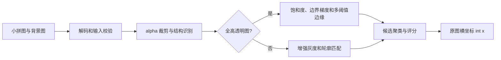

# 滑块缺口距离离线识别项目说明

## 项目定位

本项目用于离线识别滑块验证码背景图中的缺口横坐标。调用方提供“小拼图 + 背景图”，识别器返回背景图原始坐标系中的整数 `x`。

项目只处理图像数据，不负责下载图片、访问平台、控制浏览器、生成滑动轨迹或换算网页坐标。这样的边界让识别逻辑可以独立测试，也便于使用样本持续适配新的缺口结构。

## 为什么采用多特征识别

不同图片生成器留下的视觉信号并不一致：

- 透明全高图通常可以从 alpha 通道确定有效区域和纵向位置。
- 浅色缺口可以利用低饱和特征，但雪地、云层等天然浅色区域会产生干扰。
- 普通小拼图更依赖轮廓，复杂纹理又可能让单次模板匹配命中错误位置。

当前实现按图片结构组合 alpha 蒙版、高亮 alpha 轮廓、饱和度、边界梯度、多阈值 Canny 和候选聚类。多个独立特征在相近位置重复命中时，结果通常比单一阈值稳定。

## 快速使用

```python
from pathlib import Path

from CAPTCHA import HumanBehaviorSimulator

solver = HumanBehaviorSimulator()
piece = Path("piece.png").read_bytes()
background = Path("background.jpg").read_bytes()
distance = solver.slide_match_identify(piece, background)

print(distance)  # int，原始背景图中的缺口横坐标
```

接口同时接受纯 Base64 字符串和 Base64 Data URL。无法解码的图片会抛出 `ValueError`。

## 样本压缩包

[`dev/样本.zip`](../%E6%A0%B7%E6%9C%AC.zip) 是算法适配数据，不是程序运行时的强制依赖。压缩包包含：

| 数据 | 数量 | 用途 |
|---|---:|---|
| `样本1` 至 `样本9` | 140 组 | 分析新结构、开发算法和校准参数 |
| `验证样本` | 35 组 | 参数冻结后的回归验证 |
| 合计 | 175 组 | 每组包含一张 JPG 背景图、一张 PNG 小拼图和对应标签 |

每个样本目录中的 `滑块真实距离.txt` 保存图片编号与期望横坐标。开发集可以用于调试；验证集只用于最终回归，避免根据验证答案反复调参。

### 解压步骤

适配代码或运行 `dev/tests/` 下的完整测试前，必须先解压。压缩包内的顶层目录已是 `样本/`；以下脚本仅使用 Python 标准库，并主动拒绝覆盖已有目录：

```python
from pathlib import Path
from zipfile import ZipFile

archive = Path("dev/样本.zip")
target = archive.parent / "样本"

if target.exists():
    raise FileExistsError("解压目录已存在，请确认内容后再处理")

with ZipFile(archive) as package:
    package.extractall(archive.parent)

print(f"样本已解压到: {target}")
```

将以上内容保存为项目内的临时脚本后，用虚拟环境运行：

```powershell
.\.venv\Scripts\python.exe path\to\extract_samples.py
```

### 解压后结构

```text
dev/样本/
├── 样本1/
│   ├── 1.jpg
│   ├── 1.png
│   └── 滑块真实距离.txt
├── ...
├── 样本8/
├── 样本9/
└── 验证样本/
```

`dev/样本/` 已被 `.gitignore` 忽略。GitHub 只需保存压缩包，避免同一批图片占用双倍仓库空间。

## 新型滑块适配流程

1. 把同一类型的新图片按“背景 JPG + 小拼图 PNG + 标签”组成样本对。
2. 将新数据放入开发样本目录，不要先混入验证目录。
3. 记录基线结果，确认失败集中在哪类尺寸、透明通道或纹理结构。
4. 优先复用现有特征；只有现有特征无法区分时才增加新的结构分支。
5. 在开发样本全部通过后冻结参数，再运行验证集。
6. 将失败样本按类型归因；若需要继续调参，应重新划分一批未参与调试的验证数据。

样本包的主要用途就是给 AI 或开发者提供可复现输入，使其能针对新型缺口分析失败原因并适配代码，而不是依赖平台名称或单张图片坐标写特例。

## 数据流



## 项目结构

```text
slider-recognition/
├── CAPTCHA.py                         # 离线识别入口与图像算法
├── requirements.txt                  # Python 依赖
├── README.md                         # GitHub 项目入口
├── .gitignore                        # 忽略 venv、缓存和解压样本
└── dev/
    ├── 样本.zip                       # 适配与回归样本包
    ├── docs/
    │   ├── 项目说明.md                # 当前文档
    │   └── superpowers/
    │       ├── specs/                 # 识别设计与验收标准
    │       └── plans/                 # 新型滑块适配步骤
    ├── reports/
    │   ├── sample9-results.json       # 样本9逐项适配结果
    │   └── validation-results.json    # 历史逐样本验证结果
    ├── tests/
    │   ├── __init__.py
    │   └── test_captcha.py            # 输入契约和精度回归
    └── 样本/                          # 解压后生成，不提交 Git
```

### 目录职责

- `CAPTCHA.py`：唯一生产代码入口，避免把离线识别拆成不必要的服务。
- `dev/docs/`：公开的设计、使用和适配文档，不保存本机路径或凭据。
- `dev/tests/`：输入格式、候选聚类、开发集和验证集回归测试。
- `dev/reports/`：机器可读的历史验证证据。
- `dev/样本/`：由 ZIP 解压得到的本地数据，不重复提交。

## 环境与验证

```powershell
python -m venv .venv
.\.venv\Scripts\python.exe -m pip install -r requirements.txt
.\.venv\Scripts\python.exe -m unittest discover -s dev\tests -v
```

已有验证报告记录 35/35 组验证样本误差不超过 3 px，最大绝对误差为 3 px，平均绝对误差为 1.057 px。样本9为 20/20 组通过，最大绝对误差为 2 px。该结果只代表压缩包内现有分布，不应推断为所有未知平台都能达到相同精度。

## 风险

- 新尺寸、新色彩或完全不同的缺口轮廓可能需要新增开发样本和结构分支。
- 浅色自然区域会干扰饱和度特征，强纹理会干扰边缘特征。
- 返回值是原图坐标，不包含 CSS 缩放、设备像素比或滑块手柄偏移。
- 样本图片可能包含来源标识；公开新增样本前应检查图片、文件名、标签和元数据。

## 替代方案

- 轮廓几何检测：依赖少、速度快，但弱边界下容易断裂。
- 多尺度模板匹配：适合存在缩放的图片，计算成本更高。
- 轻量目标检测模型：数据量充足时泛化潜力更高，但需要标注、训练和模型部署。
- 人工规则分流：对少量固定结构见效快，但类型持续增加后维护成本会上升。
